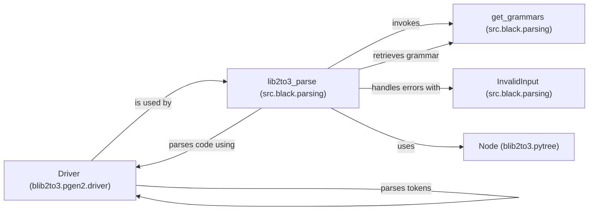

## Component Details

The AST Management subsystem is responsible for parsing Python code into an Abstract Syntax Tree (AST) using the lib2to3 library and providing functionalities to interact with the AST. It involves retrieving the grammar, parsing the code using the Driver, handling potential parsing errors, and representing the parsed code as a tree of Node objects. The subsystem's primary purpose is to provide a structured representation of the code that can be further processed and manipulated by other parts of the Black code formatter.

### Driver (blib2to3.pgen2.driver)
The `Driver` class is a core component responsible for parsing code based on a defined grammar. It takes a stream of tokens as input and constructs a parse tree representing the syntactic structure of the code. It uses the grammar to guide the parsing process and create the tree of `Node` objects.

**Related Classes/Methods**:

- `blib2to3.pgen2.driver.Driver` (108:223)
- `blib2to3.pgen2.driver.Driver.parse_string` (191:194)
- `blib2to3.pgen2.driver.Driver.parse_tokens` (115:181)

### lib2to3_parse (src.black.parsing)
The `lib2to3_parse` function serves as the main entry point for parsing Python code. It retrieves the appropriate grammar using `get_grammars`, invokes the `Driver` to parse the code, and handles any `InvalidInput` exceptions that may occur during parsing. It returns the root `Node` of the generated parse tree.

**Related Classes/Methods**:

- `src.black.parsing.lib2to3_parse` (55:102)
- `src.black.parsing.get_grammars` (24:52)
- `src.black.parsing.InvalidInput` (20:21)

### get_grammars (src.black.parsing)
The `get_grammars` function is responsible for retrieving and caching the grammar used for parsing Python code. It ensures that the grammar is loaded only once, improving performance. The grammar is used by the `Driver` to guide the parsing process.

**Related Classes/Methods**:

- `src.black.parsing.get_grammars` (24:52)

### Node (blib2to3.pytree)
The `Node` class represents a node in the parse tree generated by `lib2to3`. Each node corresponds to a syntactic element in the code, such as a statement, expression, or identifier. The nodes are linked together to form the tree structure, representing the complete syntactic structure of the parsed code.

**Related Classes/Methods**:

- `blib2to3.pytree.Node` (232:369)

### InvalidInput (src.black.parsing)
The `InvalidInput` exception is raised when the input code cannot be parsed according to the grammar. It signals that the code is syntactically incorrect and cannot be processed further. The `lib2to3_parse` function handles this exception and reports the parsing error.

**Related Classes/Methods**:

- `src.black.parsing.InvalidInput` (20:21)