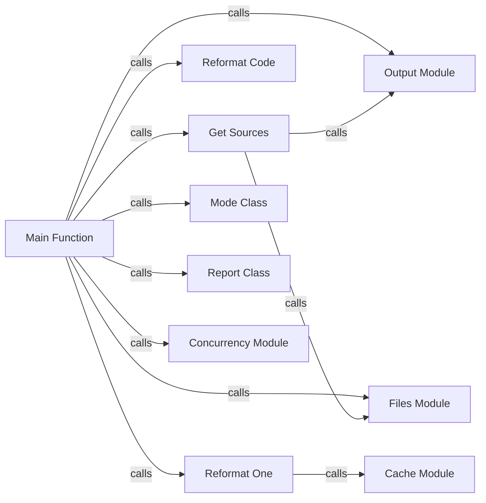

## Component Details

The Black formatter's CLI handling component orchestrates the entire formatting process. It begins by parsing command-line arguments using `argparse` and configuring the formatting `Mode` based on these arguments. The `get_sources` function then identifies Python files to be formatted, considering exclusion patterns and `.gitignore` files. The core formatting logic is handled by `reformat_one` and `reformat_code`, which apply the Black formatting rules. The `Report` class tracks the results of the formatting process, and the `Output` module handles printing messages to the console. The `Cache` module is used to avoid reformatting unchanged files. Finally, the `Concurrency` module enables parallel formatting of multiple files for improved performance.

### Main Function
The main entry point of the black formatter. It orchestrates the process of finding files, parsing command-line arguments, and reformatting code.

**Related Classes/Methods**:

- `src.black.__init__.main` (512:724)

### Get Sources
Responsible for discovering Python files to be formatted based on the input paths and command-line arguments. It handles exclusion patterns, gitignore files, and Jupyter notebook dependencies.

**Related Classes/Methods**:

- `src.black.__init__.get_sources` (727:822)

### Reformat Code
Determines whether to format code from standard input or a file. It acts as a dispatcher to the appropriate formatting function.

**Related Classes/Methods**:

- `src.black.__init__.reformat_code` (837:864)

### Reformat One
Handles the reformatting of a single file. It checks the cache, formats the file in place, and updates the cache.

**Related Classes/Methods**:

- `src.black.__init__.reformat_one` (870:923)

### Files Module
Provides utility functions for file system operations, such as finding project roots, handling gitignore files, and generating lists of Python files.

**Related Classes/Methods**:

- `black.files.find_project_root` (47:95)
- `black.files.find_user_pyproject_toml` (221:237)
- `black.files.get_gitignore` (241:252)
- `black.files.path_is_excluded` (312:317)
- `black.files.resolves_outside_root_or_cannot_stat` (255:276)
- `black.files.best_effort_relative_path` (279:289)
- `black.files.gen_python_files` (320:406)

### Output Module
Handles printing messages to standard output and standard error.

**Related Classes/Methods**:

- `black.output.out` (34:35)
- `black.output.err` (38:39)

### Mode Class
Represents the configuration options for the black formatter, such as line length and target versions.

**Related Classes/Methods**:

- `black.mode.Mode` (227:287)

### Report Class
Collects and summarizes the results of the formatting process, such as the number of files reformatted, unchanged, or failed.

**Related Classes/Methods**:

- `black.report.Report` (25:107)

### Cache Module
Provides functionality for caching the formatted files to avoid reformatting unchanged files.

**Related Classes/Methods**:

- `black.cache.Cache.read` (62:85)
- `black.cache.Cache.is_changed` (102:116)
- `black.cache.Cache.write` (133:150)

### Concurrency Module
Handles parallel reformatting of multiple files to improve performance.

**Related Classes/Methods**:

- `black.concurrency.reformat_many` (72:119)