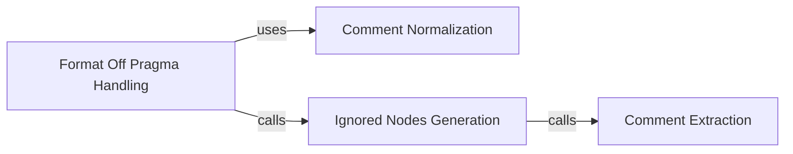

## Component Details

The Comments Handling subsystem in Black is responsible for managing and processing comments within Python code during the formatting process. It includes functionalities for identifying, normalizing, and preserving comments, as well as handling regions where formatting should be disabled or skipped. The subsystem ensures that comments are properly formatted and retained while adhering to user-defined formatting preferences.

### Comment Extraction
This component focuses on extracting all comments from the input code. It provides functions to list all comments in a file, which serves as the foundation for subsequent comment processing steps.

**Related Classes/Methods**:

- `src.black.comments.generate_comments` (53:77)
- `src.black.comments.list_comments` (81:125)

### Comment Normalization
This component normalizes comments to ensure consistency in formatting. It includes functions to normalize trailing prefixes of comments and handle `fmt: off` regions by converting them into a standard format.

**Related Classes/Methods**:

- `src.black.comments.normalize_trailing_prefix` (128:140)
- `src.black.comments.normalize_fmt_off` (169:175)

### Format Off Pragma Handling
This component manages the logic around `fmt: off` and `fmt: on` pragmas, which are used to disable and re-enable formatting for specific regions of code. It includes functions to convert these pragmas into a standardized format and determine whether formatting should be enabled or disabled at a given point in the code.

**Related Classes/Methods**:

- `src.black.comments.convert_one_fmt_off_pair` (178:261)
- `src.black.comments.is_fmt_on` (396:406)
- `src.black.comments.children_contains_fmt_on` (409:416)

### Ignored Nodes Generation
This component generates a list of nodes that should be ignored during formatting. It uses `fmt: skip` comments or `fmt: off`/`fmt: on` regions to determine which parts of the code should be left untouched by the formatter. This ensures that code within these regions is not modified.

**Related Classes/Methods**:

- `src.black.comments.generate_ignored_nodes` (264:308)
- `src.black.comments._generate_ignored_nodes_from_fmt_skip` (311:393)