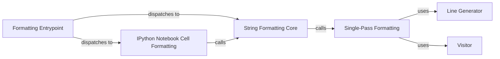

## Component Details

The Black code formatter orchestrates the process of transforming Python code into a standardized, readable format. It begins by parsing the input code into an Abstract Syntax Tree (AST), which represents the code's structure. The formatter then traverses this AST, applying a series of transformations to enforce the Black style guidelines. These transformations include adjusting whitespace, line breaks, and indentation to adhere to the prescribed style. The formatted code is then generated from the modified AST. The core formatting engine relies on other components for parsing, line generation, and string manipulation to achieve its objective of producing consistently formatted Python code.

### Formatting Entrypoint
This component serves as the initial point for formatting operations, distinguishing between Python files and IPython Notebooks to delegate formatting tasks accordingly. It also includes stability and equivalence checks post-formatting.

**Related Classes/Methods**:

- `src.black.__init__:format_file_contents` (1063:1088)

### String Formatting Core
The central component responsible for sanitizing lines, applying formatting in a single pass, and adjusting the lines to ensure consistent styling. It invokes the single-pass formatting function twice to guarantee stability.

**Related Classes/Methods**:

- `src.black.__init__:format_str` (1172:1216)

### Single-Pass Formatting
This component executes a single formatting pass on a given string. It involves parsing the code, detecting target versions, normalizing fmt_off comments, converting unchanged lines, generating lines using LineGenerator, and traversing nodes using the Visitor pattern.

**Related Classes/Methods**:

- `src.black.__init__:_format_str_once` (1219:1270)

### IPython Notebook Cell Formatting
This component specializes in formatting individual cells within an IPython Notebook. It includes validation, removal of trailing semicolons, masking, string formatting, stability and equivalence checks, unmasking, and re-insertion of trailing semicolons.

**Related Classes/Methods**:

- `src.black.__init__:format_cell` (1091:1125)

### Line Generator
Responsible for generating lines of code from the parsed syntax tree. It transforms lines and interacts with EmptyLineTracker to manage empty lines.

**Related Classes/Methods**:

- `black.linegen.LineGenerator` (101:600)

### Visitor
The visitor pattern is used to traverse the AST and apply formatting rules to each node. This allows for a modular and extensible way to handle different code constructs.

**Related Classes/Methods**: _None_