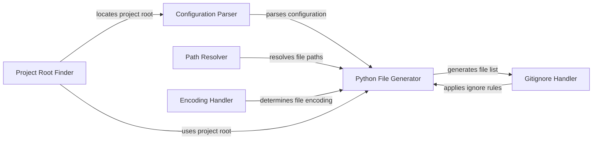

## Component Details

The File Management component in Black is responsible for handling all file-related operations, including locating the project root, parsing configuration files, generating lists of Python files to be formatted, and managing file exclusions based on .gitignore rules. It ensures that Black operates correctly on the intended set of files within a project, respecting user-defined configurations and ignoring irrelevant files.

### Project Root Finder
The Project Root Finder component identifies the root directory of a project by searching upwards from a given file path for a `pyproject.toml` file or a `.git` directory. This root directory is crucial for determining the scope of the project and locating configuration files.

**Related Classes/Methods**:

- `src.black.files.find_project_root` (47:95)

### Configuration Parser
The Configuration Parser component is responsible for parsing the `pyproject.toml` file to extract Black-specific settings. It reads the file, extracts the `[tool.black]` section, and makes the configuration available to other components. This allows users to customize Black's behavior through configuration files.

**Related Classes/Methods**:

- `src.black.files.parse_pyproject_toml` (121:135)

### Python File Generator
The Python File Generator component generates a list of Python files to be processed by Black. It traverses the project directory, filters files based on include/exclude patterns specified in the configuration, and respects `.gitignore` settings. This ensures that only relevant Python files are formatted.

**Related Classes/Methods**:

- `src.black.files.gen_python_files` (320:406)

### Gitignore Handler
The Gitignore Handler component reads and parses `.gitignore` files to determine which files should be excluded from formatting. It provides functionality to check if a given file is ignored based on the gitignore rules, preventing Black from formatting files that are intentionally excluded from version control.

**Related Classes/Methods**:

- `src.black.files.get_gitignore` (241:252)

### Path Resolver
The Path Resolver component resolves file paths, handling cases where files are located outside the project root or cannot be accessed. It ensures that file paths are correctly interpreted and processed by Black, even in complex directory structures.

**Related Classes/Methods**:

- `src.black.files.resolves_outside_root_or_cannot_stat` (255:276)
- `src.black.files.best_effort_relative_path` (279:289)

### Encoding Handler
The Encoding Handler component determines the encoding of the files to be formatted. It attempts to detect the encoding automatically and handles potential encoding errors, ensuring that Black can correctly read and write files with various encodings.

**Related Classes/Methods**:

- `src.black.files.get_encoding_from_bom` (147:160)
- `src.black.files.detect_encoding` (162:198)