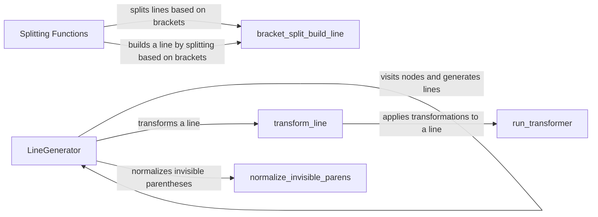

## Component Details

The Line Management component is responsible for transforming an abstract syntax tree (AST) into formatted lines of code. It handles indentation, line splitting, and the addition of comments, ensuring that the generated code adheres to the desired style guidelines. The core of this component is the LineGenerator class, which traverses the AST and generates Line objects. These lines are then processed by a series of transformations to optimize their formatting, including merging strings, stripping parentheses, and splitting long lines. Bracket tracking is used to maintain proper formatting within bracketed regions.

### LineGenerator
The LineGenerator class is responsible for traversing the abstract syntax tree (AST) of a Python code snippet and generating a sequence of lines that represent the formatted code. It uses the visitor pattern to visit each node in the AST and calls the `line` method to create a Line object for each relevant element. It handles indentation, dedentation, and various statement types.

**Related Classes/Methods**:

- `src.black.linegen.LineGenerator` (101:600)
- `src.black.linegen.LineGenerator.__init__` (108:112)
- `src.black.linegen.LineGenerator.__post_init__` (571:600)
- `src.black.linegen.LineGenerator.visit_default` (139:163)
- `src.black.linegen.LineGenerator.line` (114:137)

### transform_line
The `transform_line` function takes a Line object and applies a series of transformations to it in order to improve its formatting. These transformations include merging strings, stripping parentheses, splitting strings, and wrapping parentheses. It also handles splitting lines that are too long, especially in function definitions with right-hand sides.

**Related Classes/Methods**:

- `src.black.linegen.transform_line` (614:735)

### Splitting Functions
These functions (`left_hand_split`, `right_hand_split`, `_first_right_hand_split`, `_maybe_split_omitting_optional_parens`) are responsible for splitting lines that exceed the maximum line length. They implement different strategies for splitting lines based on brackets and parentheses, and they handle cases where optional parentheses can be omitted.

**Related Classes/Methods**:

- `src.black.linegen.left_hand_split` (775:822)
- `src.black.linegen.right_hand_split` (825:842)
- `src.black.linegen._first_right_hand_split` (845:945)
- `src.black.linegen._maybe_split_omitting_optional_parens` (948:1013)

### bracket_split_build_line
The `bracket_split_build_line` function builds a Line object by splitting a line based on brackets. It identifies the leaves inside matching brackets and appends them to the line. It also handles trailing commas and determines whether the line should be split.

**Related Classes/Methods**:

- `src.black.linegen.bracket_split_build_line` (1153:1199)

### normalize_invisible_parens
The `normalize_invisible_parens` function normalizes invisible parentheses in the AST. It handles comments, wraps elements in parentheses, and removes unnecessary parentheses. It also normalizes import from statements.

**Related Classes/Methods**:

- `src.black.linegen.normalize_invisible_parens` (1374:1480)

### run_transformer
The `run_transformer` function applies a series of transformations to a line of code. It attempts to transform the line and, if successful, checks if the transformed line is short enough. If the transformation fails, it may revert to the original line.

**Related Classes/Methods**:

- `src.black.linegen.run_transformer` (1810:1853)