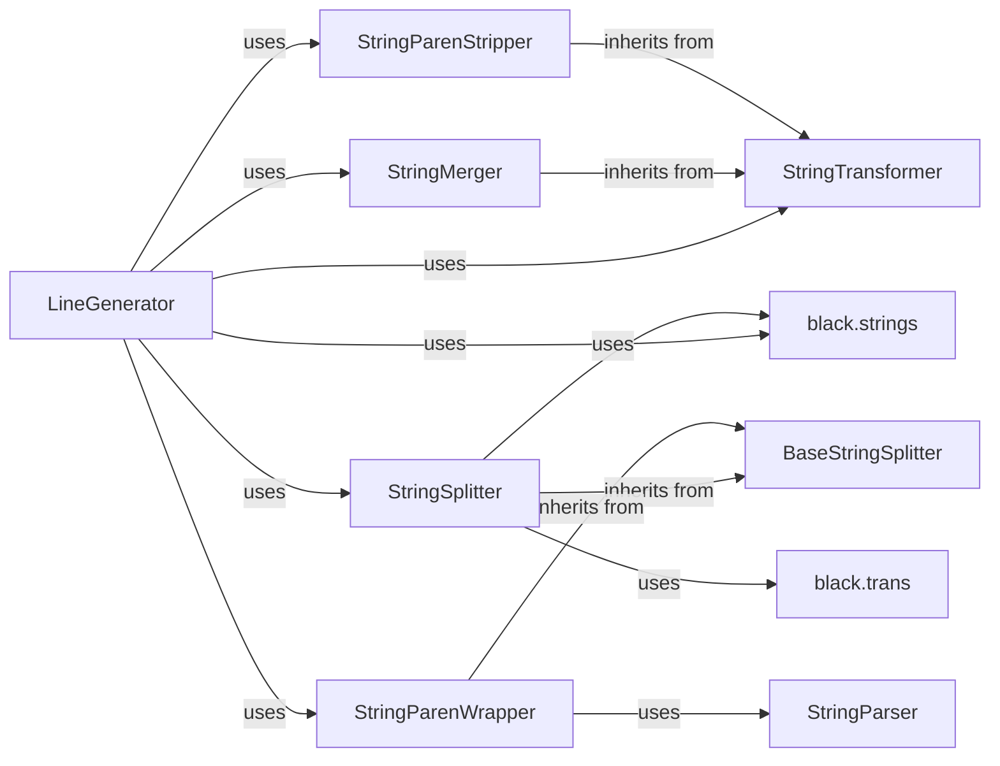

## Component Details

The String Handling component in Black focuses on ensuring string literals are formatted consistently and optimally. It merges adjacent string literals, removes unnecessary parentheses around strings, and splits long strings into multiple smaller strings to adhere to line length constraints. This process involves traversing the Abstract Syntax Tree (AST), identifying string nodes, and applying transformations using dedicated classes. The component leverages helper functions for string manipulation, quote normalization, and prefix handling to achieve its formatting goals.

### LineGenerator
The LineGenerator is responsible for traversing the AST and generating lines of code. It utilizes the String Handling components to normalize and format string literals encountered during the traversal, ensuring they adhere to Black's style guidelines.

**Related Classes/Methods**:

- `src.black.linegen.LineGenerator:visit_STRING` (418:504)
- `src.black.linegen:transform_line` (614:735)

### StringTransformer
StringTransformer serves as the base class for all string transformation operations. It defines the interface for matching and transforming string nodes in the AST. Subclasses like StringMerger, StringParenStripper, and StringSplitter inherit from this class and implement specific transformation logic.

**Related Classes/Methods**:

- `src.black.trans.StringTransformer:__call__` (274:308)

### StringMerger
StringMerger identifies and merges adjacent string literals into a single string. It considers factors like string prefixes, quotes, and line continuations to ensure the merged string is valid and well-formatted. This reduces redundancy and improves code readability.

**Related Classes/Methods**:

- `src.black.trans.StringMerger:do_match` (419:466)
- `src.black.trans.StringMerger:do_transform` (468:496)
- `src.black.trans.StringMerger:_remove_backslash_line_continuation_chars` (499:538)
- `src.black.trans.StringMerger:_merge_string_group` (540:593)
- `src.black.trans.StringMerger:_merge_one_string_group` (595:747)
- `src.black.trans.StringMerger:_validate_msg` (750:850)

### StringParenStripper
StringParenStripper removes unnecessary parentheses around string literals. It identifies cases where parentheses are redundant and removes them to simplify the code's visual structure.

**Related Classes/Methods**:

- `src.black.trans.StringParenStripper:do_match` (874:979)
- `src.black.trans.StringParenStripper:do_transform` (981:1006)
- `src.black.trans.StringParenStripper:_transform_to_new_line` (1008:1041)

### BaseStringSplitter
BaseStringSplitter provides a foundation for splitting long strings into smaller, manageable chunks. It defines the matching logic and validation steps required before splitting a string. StringSplitter and StringParenWrapper inherit from this class.

**Related Classes/Methods**:

- `src.black.trans.BaseStringSplitter:do_match` (1092:1107)
- `src.black.trans.BaseStringSplitter:_validate` (1109:1150)
- `src.black.trans.BaseStringSplitter:_get_max_string_length` (1152:1259)
- `src.black.trans.BaseStringSplitter:_prefer_paren_wrap_match` (1262:1304)

### StringSplitter
StringSplitter splits long strings into multiple smaller strings to adhere to line length limits. It considers factors like string prefixes, quotes, and f-strings to ensure the split strings are valid and maintain the original string's meaning. It uses helper functions to identify valid split points and normalize string quotes.

**Related Classes/Methods**:

- `src.black.trans.StringSplitter:do_splitter_match` (1422:1474)
- `src.black.trans.StringSplitter:do_transform` (1476:1706)
- `src.black.trans.StringSplitter:_iter_fexpr_slices` (1739:1748)
- `src.black.trans.StringSplitter:_get_illegal_split_indices` (1750:1759)
- `src.black.trans.StringSplitter:_get_break_idx` (1761:1844)
- `src.black.trans.StringSplitter:_maybe_normalize_string_quotes` (1846:1848)
- `src.black.trans.StringSplitter:_normalize_f_string` (1850:1875)
- `src.black.trans.StringSplitter:_get_string_operator_leaves` (1877:1886)

### StringParenWrapper
StringParenWrapper wraps strings in parentheses when necessary, particularly in cases where splitting a string across multiple lines requires explicit grouping. It determines the appropriate context for wrapping strings and adds parentheses accordingly.

**Related Classes/Methods**:

- `src.black.trans.StringParenWrapper:do_splitter_match` (1947:1983)
- `src.black.trans.StringParenWrapper:_return_match` (1986:2008)
- `src.black.trans.StringParenWrapper:_else_match` (2011:2035)
- `src.black.trans.StringParenWrapper:_assert_match` (2038:2070)
- `src.black.trans.StringParenWrapper:_assign_match` (2073:2117)
- `src.black.trans.StringParenWrapper:_dict_or_lambda_match` (2120:2156)
- `src.black.trans.StringParenWrapper:do_transform` (2158:2279)

### StringParser
StringParser analyzes the structure of strings to determine if they need to be split or wrapped in parentheses. It helps StringParenWrapper to decide when parentheses are needed.

**Related Classes/Methods**:

- `src.black.trans.StringParser:parse` (2354:2370)
- `src.black.trans.StringParser:_next_state` (2372:2421)

### black.strings
The `black.strings` module provides utility functions for manipulating strings, including normalizing quotes, prefixes, and unicode escape sequences. These functions are used by other components to ensure consistent string formatting.

**Related Classes/Methods**:

- `src.black.strings:fix_multiline_docstring` (66:86)
- `src.black.strings:get_string_prefix` (89:105)
- `src.black.strings:normalize_string_quotes` (169:239)
- `src.black.strings:normalize_fstring_quotes` (242:304)
- `src.black.strings:normalize_unicode_escape_sequences` (307:335)
- `src.black.strings:count_chars_in_width` (378:389)

### black.trans
The `black.trans` module contains functions for transforming strings, such as identifying f-strings and toggling quotes. These functions are used by other components to perform specific string transformations.

**Related Classes/Methods**:

- `src.black.trans:fstring_contains_expr` (1354:1355)
- `src.black.trans:_toggle_fexpr_quotes` (1358:1379)