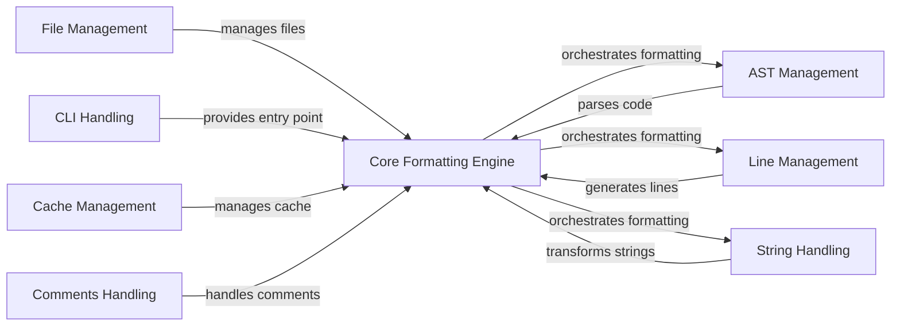

## Component Details

Black is a Python code formatter that automatically formats code to adhere to a consistent style, making it more readable and maintainable. The core formatting process involves parsing the code into an Abstract Syntax Tree (AST), transforming the AST to enforce Black's style rules, and then generating the formatted code. Key aspects include handling file input/output, managing a cache to avoid reformatting unchanged files, and providing a command-line interface for users to interact with the formatter.

### Core Formatting Engine
This component orchestrates the entire formatting process. It takes Python code as input, parses it into an AST, applies transformations to enforce Black's style, and generates the formatted code. It relies on other components for parsing, line generation, and string manipulation.

**Related Classes/Methods**:

- `src.black.__init__.format_str` (1172:1216)
- `src.black.__init__._format_str_once` (1219:1270)

### AST Management
This component handles the parsing of Python code into an Abstract Syntax Tree (AST) and provides utilities for working with AST nodes. It uses a modified version of the lib2to3 library for parsing and includes functions for identifying node types, extracting information from nodes, and modifying the tree structure.

**Related Classes/Methods**:

- `src.blib2to3.pgen2.driver.Driver.parse_string` (191:194)
- `src.black.parsing.lib2to3_parse` (55:102)

### Line Management
This component takes the transformed AST and generates lines of code. It is responsible for line splitting, indentation, and adding comments. It uses the BracketTracker to keep track of brackets and delimiters to ensure proper formatting within bracketed regions.

**Related Classes/Methods**:

- `src.black.linegen.LineGenerator` (101:600)
- `src.black.linegen.transform_line` (614:735)

### String Handling
This component focuses on manipulating string literals within the code. It includes functionalities for merging, splitting, and stripping parentheses from strings to optimize their formatting and readability. It uses transformers to modify the string representations in the AST.

**Related Classes/Methods**:

- `src.black.trans.StringMerger` (399:850)
- `src.black.trans.StringParenStripper` (853:1041)
- `src.black.trans.StringSplitter` (1382:1886)

### File Management
This component manages file input and output operations. It includes functions for finding project roots, parsing configuration files (pyproject.toml), generating Python file lists, and handling file encoding. It also deals with ignoring files based on `.gitignore` and resolving paths.

**Related Classes/Methods**:

- `src.black.files.find_project_root` (47:95)
- `src.black.files.parse_pyproject_toml` (121:135)
- `src.black.files.gen_python_files` (320:406)

### CLI Handling
This component provides the entry point for the Black formatter. It parses command-line arguments, configures the formatting mode, and orchestrates the formatting process. It also handles reporting and error handling.

**Related Classes/Methods**:

- `src.black.__init__.main` (512:724)
- `src.black.__init__.patched_main` (1584:1592)
- `src.black.__init__.get_sources` (727:822)

### Cache Management
This component handles caching of formatted files to improve performance. It includes functions for reading, writing, and checking the cache. It determines whether a file has changed since the last formatting and avoids reformatting unchanged files.

**Related Classes/Methods**:

- `src.black.cache.Cache.read` (62:85)
- `src.black.cache.Cache.write` (133:150)
- `src.black.cache.Cache.is_changed` (102:116)

### Comments Handling
This component manages comments within the code. It includes functions for generating comments, normalizing comment prefixes, and handling fmt: off/on regions. It ensures that comments are properly formatted and preserved during the formatting process.

**Related Classes/Methods**:

- `src.black.comments.generate_comments` (53:77)
- `src.black.comments.normalize_trailing_prefix` (128:140)
- `src.black.comments.normalize_fmt_off` (169:175)